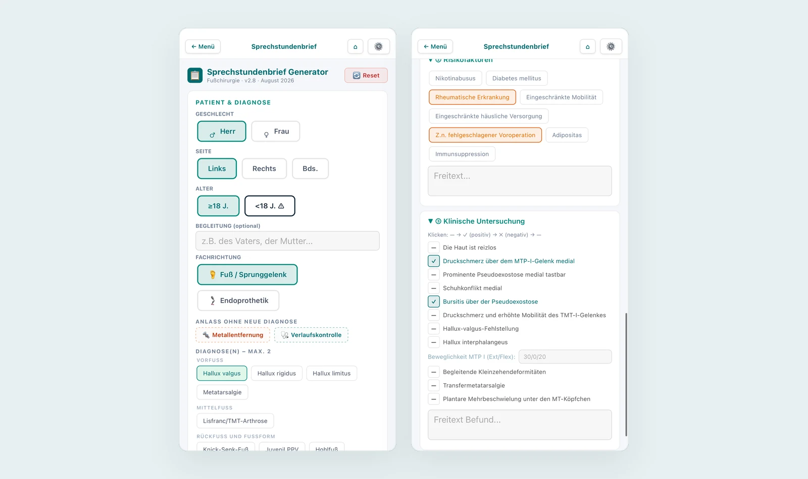

# Auftrag an die Clinic-Code-Sitzung: echte Screenshots auf der Landingpage

Kontext: In `index.html` stehen im Abschnitt „Vier Werkzeuge. Ein Fachgebiet." vier Platzhalter (`.shot-ph`, „Screenshot: … (wird ergänzt)"). Es liegen jetzt sechs fertige Bilder im Repo unter `bilder/screens/`, alle 1600 × 950, also exakt das Seitenverhältnis 16 : 9.5, das `.shot-ph` heute erzwingt. Nichts zuschneiden, nichts skalieren.

## Dateien

Alle in `bilder/screens/`, jeweils zusätzlich als `…-800.webp` für kleine Bildschirme. Jede Datei unter 90 KB.

| Datei | Inhalt |
|---|---|
| `clinic-sprechstundenbrief.webp` | Eingabemaske mit gruppierten Diagnosen, daneben die klinische Untersuchung |
| `clinic-op-bericht.webp` | Eingriffsauswahl Rückfuß, daneben Materialsumme und Berichtsvorschau mit Word-Export |
| `clinic-fallsteuerung.webp` | Zwei Fälle: Chevron-Osteotomie ambulant gegen stationär, TN-Arthrodese mit Belegungstagen und Deckungsbeitrag |
| `clinic-klassifikationen.webp` | Gefilterte Klassifikationsliste, daneben die Wagner-Graduierung mit Tabelle und Quelle |
| `clinic-roentgen.webp` | Meary-Winkel mit Normwert und Quelle, daneben die Referenzaufnahme mit eingezeichneten Achsen |
| `clinic-ops-katalog.webp` | OPS-Suche 2026 mit Treffern, daneben zwei Treffer vergrößert mit AOP- und Hybrid-DRG-Kennzeichnung |
| `clinic-uebersicht.webp` | Hauptmenü mit den acht Werkzeugen, als Hero-Bild oder Reserve |
| `clinic-kodierlogik.webp` | Kontextprozeduren und H-DRG-Aufwertung, Reserve |
| `og-clinic.jpg` | 1200 × 630 für die LinkedIn-Vorschau |

## Aufgaben

1. **Abschnitt auf sechs Blöcke erweitern.** Aus den vier bestehenden `.feature`-Blöcken werden sechs, jeder mit einem Bild. Die Überschrift „Vier Werkzeuge. Ein Fachgebiet." passt dann nicht mehr, Vorschlag: „Ein Werkzeugkasten für ein Fachgebiet." Der Wechsel der Bildseite über `nth-child(even)` bleibt wie er ist und ergibt weiterhin ein sauberes Zickzack.

   Reihenfolge und Zuordnung:

   1. Sprechstundenbrief in Minuten → `clinic-sprechstundenbrief.webp` (Text bleibt)
   2. OP-Berichte, die Kodierung und Erlös mitdenken → `clinic-op-bericht.webp` (Text bleibt)
   3. **Neuer Block: Ambulant oder stationär, vor der Entscheidung sichtbar** → `clinic-fallsteuerung.webp`
      Textvorschlag: „Die Fallsteuerung rechnet beide Wege durch: Hybrid-DRG gegen volle DRG, Belegungstage und Grenzverweildauer, Materialkosten gegen die InEK-Referenz. Welche Kontextprozedur die Hybrid-DRG kostet und wo eine Aufwertung möglich ist, steht dabei, bevor der Eingriff geplant wird."
   4. **Neuer Block: Klassifikationen mit Quelle** → `clinic-klassifikationen.webp`
      Textvorschlag: „Rund 47 Klassifikationen des Fachgebiets, filterbar nach Krankheitsbild und Region, jede mit vollständiger Graduierung und der Originalarbeit samt DOI. Kein Suchen in alten Foliensätzen, keine halb erinnerten Grade."
   5. OP-Anleitungen und Röntgenmessungen griffbereit → `clinic-roentgen.webp`
      Der bestehende Text passt, nur der Teil zu Klassifikationen wandert in Block 4. Vorschlag: „Hinterlegte OP-Techniken und 26 Messmethoden mit bebilderten Referenzaufnahmen. Zu jeder Messung Normwert, Definition und Quelle, nachschlagbar in Sekunden, auch am Tablet im OP-Trakt."
   6. Abrechnungswissen, jährlich gepflegt → `clinic-ops-katalog.webp` (Text bleibt)

   Wenn sechs Blöcke die Seite zu lang machen, sind Block 4 und 5 die Kandidaten zum Zusammenlegen; dann `clinic-roentgen.webp` nehmen, weil die Referenzaufnahme das stärkere Bild ist, und `clinic-klassifikationen.webp` als Reserve führen.

2. **Bild-Markup statt Platzhalter.** In den `.shot`-Blöcken entfällt die Punktleiste `.shot-bar`, weil die Bilder Handyansichten zeigen und eine Fensterleiste darüber falsch wirkt. Die weiße Karte mit Rahmen und Schatten bleibt. Markup je Block:

   ```html
   <div class="shot">
     
   </div>
   ```

   CSS dazu: `.shot img{display:block;width:100%;height:auto}`. `.shot-ph` und `.shot-bar` können entfallen, sobald kein Platzhalter mehr steht.

3. **Alt-Texte** (sachlich, ohne Werbesprache):
   - Sprechstundenbrief: „Eingabemaske des Sprechstundenbrief-Generators mit nach Vorfuß, Mittelfuß und Rückfuß gruppierten Diagnosen und der klinischen Untersuchung"
   - OP-Bericht: „OP-Bericht-Generator mit Auswahl der Rückfußeingriffe, Materialsumme im Vergleich zur InEK-Referenz und fertigem Berichtstext"
   - Fallsteuerung: „Fallsteuerung mit Gegenüberstellung von ambulanter und stationärer Führung, Belegungstagen und Deckungsbeitrag"
   - Klassifikationen: „Klassifikationsliste mit Filtern nach Krankheitsbild und Region, daneben die Wagner-Graduierung des diabetischen Fußulkus mit Quellenangabe"
   - Röntgen: „Messmethode Meary-Winkel mit Normwert, Quelle und einer seitlichen Standaufnahme des Fußes mit eingezeichneten Achsen"
   - OPS-Katalog: „OPS-Suche des Katalogjahres 2026 mit Treffern, gekennzeichnet nach AOP-Katalog und Hybrid-DRG"

4. **og:image setzen.** `bilder/screens/og-clinic.jpg` als `og:image` für `fuss-track.de` eintragen, mit absoluter URL, dazu `og:image:width` 1200 und `og:image:height` 630. Damit ist Punkt 4 aus `auftrag-interessenten-zeile.md` für die Clinic-Seite erledigt; die Patientenseite braucht weiterhin ein eigenes Bild.

5. **Gegenprobe.** Seite lokal laden, Netzwerk-Tab prüfen: nur lokale Bilder, keine externen Anfragen. Mobile Ansicht bei 390 px Breite kontrollieren, dort steht das Bild unter dem Text und darf nicht über die Kartenkante hinauslaufen. Sechs Bilder zusammen bleiben unter 420 KB; alle außer dem ersten laden verzögert.

## Hinweise zum Inhalt der Bilder

Die Beträge in den Bildern sind bewusst stehen geblieben. Sichtbar sind nur Summen und Katalogwerte: DRG- und Hybrid-DRG-Erlöse, InEK-Fallkosten, InEK-Materialreferenz sowie eine Materialsumme. Herstellernamen, Artikelbezeichnungen, Stückzahlen und Einzelpreise sind in keinem Bild zu sehen, die entsprechenden Zeilen wurden beim Zuschnitt entfernt. Aus keiner Summe lässt sich auf eine Einkaufskondition zurückrechnen. Für weitere Aufnahmen gilt dasselbe Kriterium: Summen ja, Artikelzeilen nein.

Die Referenzaufnahme im Röntgen-Bild trägt nur die Seitenkennung und den Hinweis auf die Standaufnahme, keine Patientenangaben und kein Aufnahmedatum. Auch das ist vor jeder weiteren Aufnahme zu prüfen.

Deploy wie üblich: Commit durch die Code-Sitzung, Push durch Benjamin nach Sichtprüfung.

---

# Nachtrag: Patienten-App auf der Clinic-Seite sichtbar machen

Auf `fuss-track.de` kommt die Patienten-App bisher nur einmal vor, als Link in der Fußzeile. Das ist die größte inhaltliche Lücke der Seite, denn der Zusammenhang zwischen beiden Anwendungen ist das eigentliche Argument: Jeder Brief und jede Aufklärung aus Clinic trägt einen QR-Code, der den Patienten genau an die passende Stelle der kostenlosen Patienten-App führt. Der Behandler standardisiert seinen Prozess, der Patient bekommt automatisch die Begleitung dazu.

## Neue Dateien in `bilder/screens/`

| Datei | Inhalt |
|---|---|
| `patienten-uebersicht.webp` (+ `-800`) | Startseite der Patienten-App mit Begleiter, Infomaterial und Beschwerde-Wegweiser, daneben ein Infomaterial-Artikel zur Baxter-Neuropathie |
| `patienten-infomaterial.webp` (+ `-800`) | Zwei Infomaterial-Ansichten: Botulinumtoxin bei Plantarfasziitis mit Abschnittsübersicht, Arthrorise beim Kind mit Komplikationsraten und Quellenmarkern |
| `og-patienten.jpg` | 1200 × 630 für die LinkedIn-Vorschau von `patienten.fuss-track.de` |

Format und Aufbereitung wie bei den Clinic-Bildern: 1600 × 950, Statusleiste und Adresszeile entfernt, Hintergrund in der Petrol-Farbwelt der Clinic-Seite, damit die Bilder dort nicht fremd wirken.

## Aufgabe

Einen neuen Abschnitt zwischen `section.features` und `section.trust` einziehen, im Aufbau wie ein `.feature`-Block, aber optisch abgesetzt (zum Beispiel mit `var(--op-tint)` als Hintergrund), damit klar wird: Hier ist von der zweiten Anwendung die Rede.

Überschrift: „Ihre Patienten bekommen die Begleitung dazu."

Textvorschlag: „Jeder Brief und jede Aufklärung aus Fuss-Track Clinic trägt einen QR-Code, der direkt zur passenden Stelle der Patienten-App führt: tagesgenaue Begleitung vom Vorbereitungstermin bis drei Monate nach dem Eingriff, verständliche Informationen zu Krankheitsbild und Verfahren, alles mit Quellen belegt. Die Patienten-App ist kostenlos, werbefrei, ohne Konto und ohne Datensammlung, und sie bleibt es."

Darunter ein Link auf `patienten.fuss-track.de` mit `target="_blank"` und `rel="noopener"`, Beschriftung „Patienten-App ansehen". Bild: `patienten-uebersicht.webp`, Markup wie bei den übrigen Blöcken.

`patienten-infomaterial.webp` ist die Reserve, falls der Abschnitt zwei Bilder tragen soll oder ein späterer Block zur Qualität der Inhalte entsteht.

Alt-Texte:
- Übersicht: „Startseite der Patienten-App mit den Bereichen Begleiter, Infomaterial und Beschwerde-Wegweiser, daneben ein Informationsartikel zur Baxter-Neuropathie"
- Infomaterial: „Zwei Informationsartikel der Patienten-App, einer zur Botulinumtoxin-Injektion bei Plantarfasziitis, einer zu Komplikationen der Arthrorise beim Kind"

## Zusätzlich

`og-patienten.jpg` als `og:image` für `patienten.fuss-track.de` eintragen, mit absoluter URL und `og:image:width` 1200, `og:image:height` 630. Damit ist Punkt 4 aus `auftrag-interessenten-zeile.md` für beide Seiten erledigt.

Benjamin hat angekündigt, weitere Aufnahmen der Patienten-App nachzureichen, insbesondere zum Begleiter. Der Abschnitt sollte deshalb so gebaut sein, dass ein zweites Bild ohne Umbau danebenpasst.

## Ergänzung: Beschwerde-Wegweiser

`patienten-wegweiser.webp` (+ `-800`) zeigt den Weg durch den Beschwerde-Wegweiser in drei Karten nebeneinander: Schritt 2 mit der Markierung am Fußfoto, Schritt 3 mit der Frage zu den Beschwerden am inneren Fußrücken, Schritt 4 mit den vorgeschlagenen Themen und dem Hinweis, dass es sich nicht um eine Diagnose handelt. Das ist das zweite Bild für den Patienten-Abschnitt.

Alt-Text: „Drei Schritte des Beschwerde-Wegweisers: Markierung der schmerzhaften Stelle am Fußfoto, Frage zu den Beschwerden, Vorschlag passender Informationsthemen mit Hinweis, dass keine Diagnose gestellt wird"

Wenn der Abschnitt zwei Bilder trägt, `patienten-uebersicht.webp` zuerst und `patienten-wegweiser.webp` darunter oder daneben. Der Textvorschlag bekommt dann einen zweiten Satz: „Wer noch keine Diagnose hat, kann sich über den Beschwerde-Wegweiser an mögliche Ursachen herantasten; er schlägt Informationsthemen vor und sagt ausdrücklich, dass er keine Diagnose stellt."

Das Fußfoto in Schritt 2 ist dasselbe, das in der Patienten-App bereits öffentlich verwendet wird, ohne Gesicht und ohne Personenbezug. Es entsteht dadurch keine neue Veröffentlichung.

## Ergänzung: Begleiter

`patienten-begleiter.webp` (+ `-800`) zeigt die Kernfunktion der Patienten-App: links die Auswahl zwischen OP-Begleiter und Non-OP-Begleiter, rechts einen laufenden konservativen Verlauf nach frischer Außenbandverletzung mit Stufenanzeige, Woche seit dem Unfall und den fünf Stufen von Return to daily life bis Return to competition.

Alt-Text: „Auswahl zwischen OP-Begleiter und Non-OP-Begleiter, daneben ein laufender Verlauf nach Außenbandverletzung mit aktueller Stufe, Woche seit dem Unfall und fünf Stufen von der Alltagsbelastung bis zur Rückkehr in den Wettkampf"

Damit kann der Patienten-Abschnitt drei Bilder tragen. Reihenfolge nach Aussagekraft: erst `patienten-begleiter.webp` (die Kernfunktion), dann `patienten-uebersicht.webp` (der Einstieg), dann `patienten-wegweiser.webp` (der Weg ohne Diagnose). Wenn nur eines gezeigt wird, ist es der Begleiter.

Ein weiteres Bild zu den Übungsprogrammen wird nachgereicht und ersetzt dann die zweite Karte dieses Bildes oder tritt daneben.
